# MCBE-Skyblock-Addon

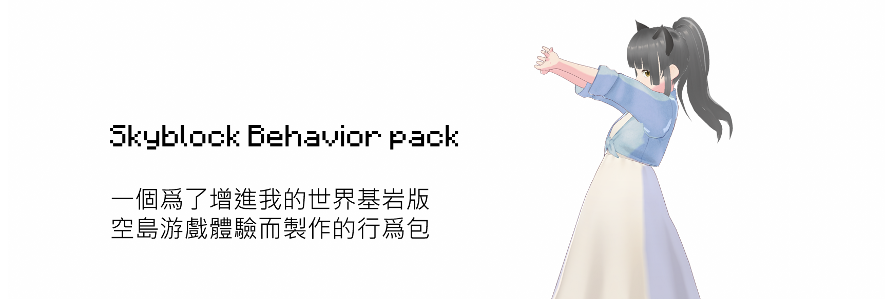

語言：
中文 [英文](https://github.com/TimothyGrass/MCBE-Skyblock-Addon/blob/main/README.md)

MCBE Skyblock Addon 是一個爲了下列目標而開發的:

- 所有資源皆可再生
- 所有資源皆可獲得
- 不取代原版的游戲機制
- 加深對於原版游戲機制的了解

## 安裝

1. 於[Release](https://github.com/TimothyGrass/MCBE-Skyblock-Addon/releases)下載.mcpack檔案
2. 雙擊.mcpack 檔案並使用 Minecraft:Bedrock Edition 打開
3. 於世界設定啓用行爲包

## 空島地圖下載

空島地圖由 [CrazyBreeze1074](https://github.com/Breeze1074) 獨自完成開發，點擊[這裏](https://github.com/Breeze1074/VoidWorld_v0)到達網站並下載.mcworld

## 特性

### 部分物品的客制化合成

---

#### 原礦方塊獲取

原礦方塊可以透過合成獲得:

可合成原礦:
| 主世界石頭類礦石 | 主世界深岩板類礦石 | 地獄岩與黑石類礦物|
| ---------------- | ------------------ | ----------------- |
| 鐵礦             | 深板岩鐵礦         | 地獄金礦          |
| 金礦             | 深板岩金礦         | 地獄石英礦        |
| 鑽石礦           | 深板岩鑽石礦       | 鑲金黑石          |
| 青金石礦         | 深板岩青金石礦     |                   |
| 紅石礦           | 深板岩紅石礦       |                   |
| 煤礦             | 深板岩煤礦         |                   |
| 銅礦             | 深板岩銅礦         |                   |
| 綠寶石礦         | 深板岩綠寶石礦     |                   |

---

#### 可合成未熔煉金屬礦物:

| 成品          | 材料 1                 | 材料 2                |
| :-----------: | :--------------------: | :-------------------: |
|  |  | 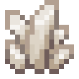 |
| 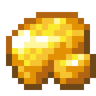 | 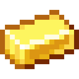 |  |
| 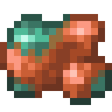 | 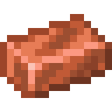 |  |

---

#### 可合成的作物

##### 地獄作物獲取

1. 垂泣藤  
藤蔓 + 緋紅蕈菇 + 緋紅菌絲石

2. 扭曲藤  
藤蔓 + 扭曲蕈菇 + 詭異菌絲石

3. 地獄疙瘩  
紅蘑菇 + 發酵蜘蛛眼 + 靈魂沙

##### 主世界作物獲取

1. 發光地衣  
藤蔓 + 發光墨囊

2. 發光莓果  
甜莓 + 發光地衣

---

#### 可合成所有馬鎧

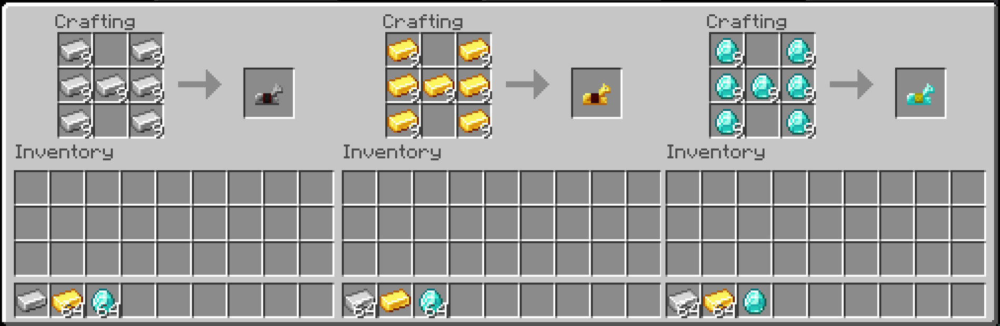

---

#### 可合成珊瑚方塊

可以用四個同樣未白化的珊瑚合成珊瑚方塊，包括:

1. 管珊瑚
2. 腦珊瑚
3. 氣泡珊瑚
4. 火珊瑚
5. 角珊瑚

---

#### 可合成的其他方塊

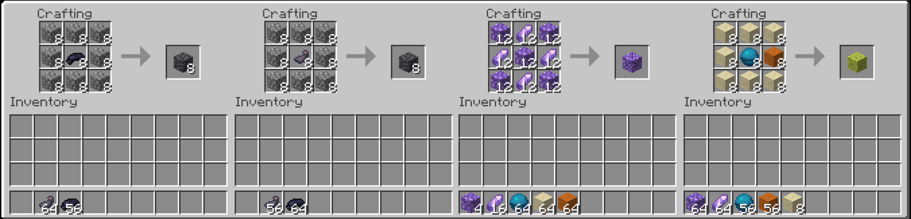

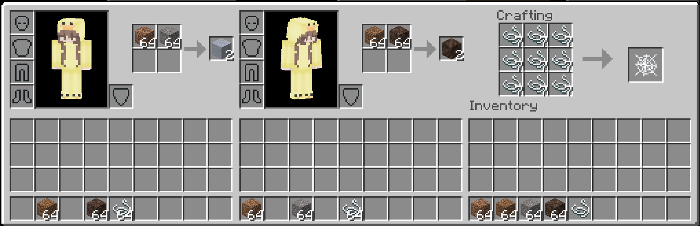

---

### 可用熔爐熔煉獲取的物品

#### 凝灰岩獲取

1. 熔煉安山岩以獲得凝灰岩

#### 方解石獲取

2. 熔煉閃長岩以獲得方解石

---

### 可用營火與靈魂螢火獲取的物品

#### 烘乾各種樹苗

生產枯木
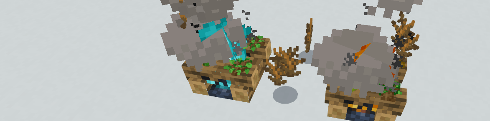

---

### 調整生物掉落物

#### 海豚有1%幾率掉落海洋之心

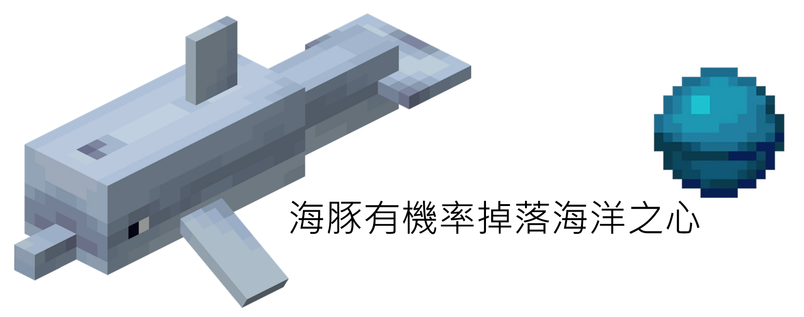

---

#### 苦力怕被流髑或骷髏擊殺會掉落所有種類的唱片之一

---

### 調整交易物品選項

#### 與流浪商人的交易

- 購買桶類物品需要一個鐵桶與五個綠寶石
- 增加岩漿桶作爲桶類交易選項
- 將孢子花加入花的交易選項
- 紫水晶將共享鸚鵡螺殼的交易選項出現幾率
- 詭異菌絲岩、緋紅菌絲岩與菌絲土將共享灰壤交易選項出現幾率

---

#### 與工具商人的交易

- 以**32**個綠寶石交易獲得**1**個鑽石
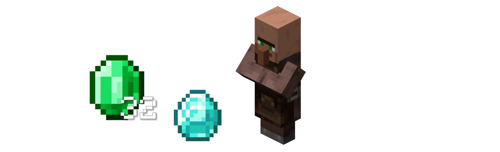

---

#### 豬靈交易

- **0.2%**幾率得到**1**個遠古遺骸

### 可再生界伏蚌生成機制 （將於 v1.0.1加入）

- 特別鳴謝由 Golden Helmet 獨自完成的生成機制開發
- 界伏蚌有 75% 機率生成，當：
  - 被界伏蚌的導彈擊中
  - 貝殼是打開狀態
  - 被攻擊的界伏蚌剩餘 < 50% 血量
  - 被攻擊的界伏蚌 8 格内有 < 6 界伏蚌
  - 能成功傳送離開原本所處的坐標
- 生成後新界伏蚌將於舊的界伏蚌位置生成

## 鳴謝

- [CrazyBreeze1074](https://github.com/Breeze1074)
- [Golden Helmet](https://www.youtube.com/channel/UCcrW5iYh_4Z2pXZwu-vFUkw)
- [Rayth Co](https://github.com/RaythCo-Creations)
- [jsorrell](https://github.com/jsorrell)
- [ddf8196](https://github.com/ddf8196)
- [Frozen](https://space.bilibili.com/7543512)
- [Daisy AC17](https://space.bilibili.com/433369355)
- [Rock C.](https://github.com/rockclw)
- [TNT Sky](https://github.com/TNTsky)
- [bridge.](https://github.com/bridge-core/bridge.)